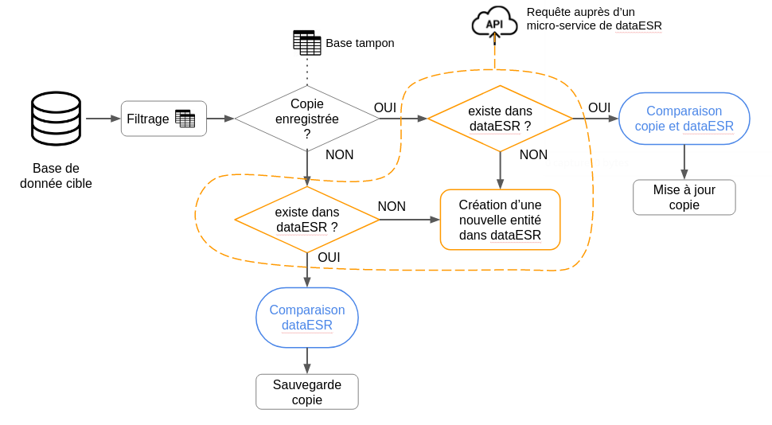
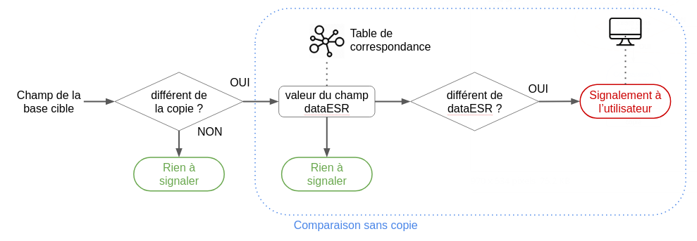

# DataESR BCE [](https://travis-ci.org/ambreelmee/conflicts-management)

This micro-service is part of the backend architecture of the dataESR project.
Its purpose is to help the administrator updating the main database **dataESR** with distant source databases by dealing with conflictual cases. It is based on Flask framework with a postgres database and was specifically designed to work with the **Base centrale des établissement**.

## Table of Contents
1. [Diagram](#diagram)
1. [Dependencies](#dependencies)
1. [Getting Started](#getting-started)
1. [Commands](#commands)
1. [Database](#database)
1. [Application Structure](#application-structure)
1. [Development](#development)
1. [Testing](#testing)
1. [Lint](#lint)
1. [Swagger](#swagger)

## Diagram *[French section]*

Le script de mise à jour de dataESR à partir des informations de la bce est structuré selon le schéma ci-dessous :
#### Schéma global


Détail du processus :

- L’étape de filtrage consiste à parcourir l’ensemble de la base cible et de sélectionner les entités à traiter en fonction de critères pré-établis. Cette information est ensuite stockée sous forme de booléen pour permettre à l’utilisateur de modifier manuellement le statut d’une entité (par exemple, retirer un établissement qui ne fait finalement pas partie du champ de l’ESR).

- Pour chaque entitée qui fait partie du champ de l’ESR, une base tampon permet de stocker tous les champs qui lui sont liés  un instant donné, afin de détecter directement les champs qui ont été mis à jour.

- Une requête API permet de récupérer les informations actuellement enregistrée dans dataESR pour l’entité en question, si elle existe. Dans le cas contraire, une nouvelle entitée est créée dans dataESR. La copie et / ou les informations dans dataESR nous permettent alors de comparer champ par champ les valeurs.

- A la fin du processus, on enregistre dans tous les cas les nouvelles valeurs de la copie.

#### Comparaison champ par champ


Détail du processus de comparaison :

- Chaque champ est d’abord comparé à sa dernière valeur enregistrée, celle de la copie. Si ces deux valeurs sont identiques, alors il n’y a rien à signaler à l’utilisateur et on peut passer au champ suivant.

- Dans le cas contraire, on récupère ensuite la valeur correspondante dans dataESR. Pour cela,on fait appel à une table de correspondance qui permet de lier un champ de la base cible externe à la base interne dans dataESR. C’est seulement lorsque ces valeurs diffèrent qu’on le signale à l’utilisateur.


## Dependencies

You will need [docker](https://docs.docker.com/engine/installation/) and  [docker-compose](https://docs.docker.com/compose/install/).

## Getting Started

First, clone the project, install dependencies and check that it works

```bash
$ make install      # Install the pip dependencies on the docker container
$ make start        # Run the container containing your local python server
```
If everything works, you should see the available routes [here](http://127.0.0.1:3000/api/spec).


## Commands

While developing, you will probably rely mostly on `make start`; however, there are additional scripts at your disposal in the Makefile:

|`make <script>`|Description|
|------------------|-----------|
|`install`|Install the pip dependencies on the server's container.|
|`start`|Run your local server in its own docker container.|
|`daemon`|Run your local server in its own docker container as a daemon.|
|`db/connect`|Connect to your docker database.|
|`db/migrate`|Generate a database migration file using alembic, based on your model files.|
|`db/upgrade`|Run the migrations until your database is up to date.|
|`db/downgrade`|Downgrade your database by one migration.|
|`tests`|Run unit tests with unittest in its own container.|
|`lint`|Run flake8 on the `src` directory.|


## Application Structure


```
.
├── migrations               # Database's migrations settings
│   └── versions             # Database's migrations versions generated by alembic
├── src                      # Application source code
│   ├── models               # Python classes modeling the database
│   ├── repositories         # Python classes allowing you to interact with your models
│   ├── resources            # Python classes containing the HTTP verbs of your routes
│   ├── routes               # Routes definitions and links to their associated resources
│   ├── swagger              # Resources documentation
│   ├── tasks                # Scripts to update database using the bce
│   ├── util                 # Some helpfull, non-business Python functions for your project
│   ├── config.py            # Project configuration settings
│   ├── manage.py            # Project commands
│   └── server.py            # Server configuration
└── test                     # Unit tests source code
```
